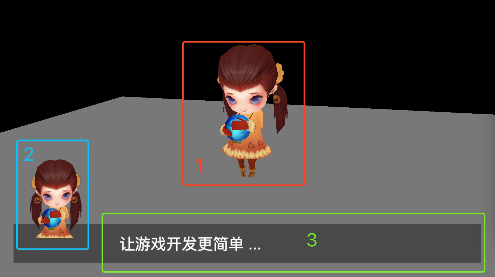
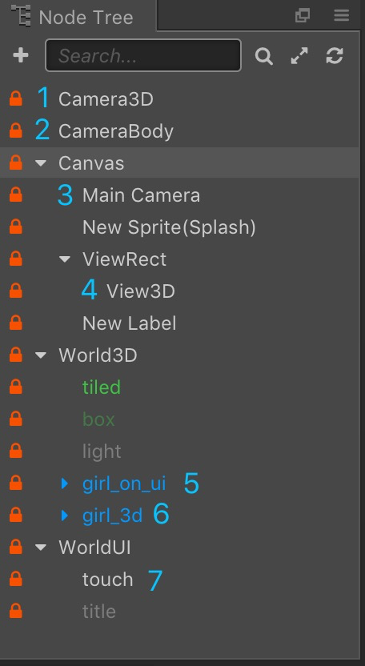
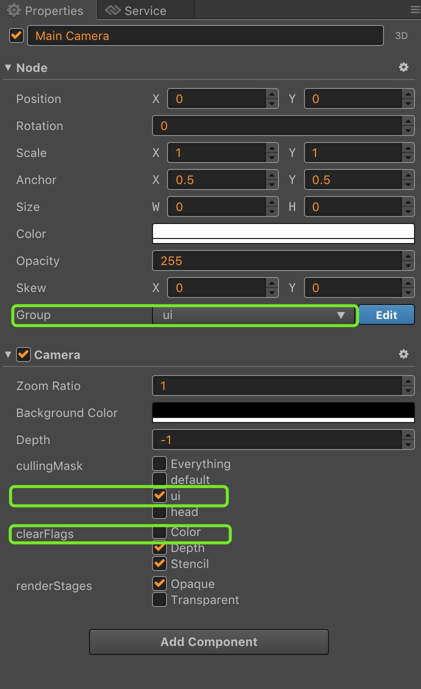

# Third-person game in Cocos Creator 2.1.2

This article will use a number of cameras to build a simple third-person game, familiar with the use of camera modules through practice, this tutorial will cover the following points.

[Camera] (https://docs.cocos.com/creator/2.1/manual/en/render/camera.html )

[Group Management] (https://docs.cocos.com/creator/manual/en/physics/collision/collision-group.html#group-management)

[Component Script] (https://docs.cocos.com/creator/manual/en/scripting/use-component.html#creating-component-script)

[Node System Events] (https://docs.cocos.com/creator/manual/en/scripting/internal-events.html)

[Global System Events] (https://docs.cocos.com/creator/manual/en/scripting/player-controls.html)

### Display of results

A simple third-person game that requires a focus target, a camera that rotates around the target, and some UI interfaces for interaction. This tutorial will implement the following.

1. Free viewing angle control of 3D characters.
2. The display of 3D characters in the UI.
3. Display of the UI interface.
4. Move the control and operate with the buttons [A] [W] [S] [D]
5. Rotate the lens, hold down the left mouse button and drag to zoom the view



### World node tree

Briefly introduce the structure of our node tree:

1. Ceamra3D camera for free rotation around the target (girl_3d)
2. CameraBody is used to render the 3D target (girl_on_ui) to the 2D interface.
3. Main Camera Camera for 2D interface rendering
4. View3D A 2D Sprite for receiving 3D models rendered by CameraBody
5. girl_3d a 3D character model
6. girl_on_ui a 3D character model
7. touch is used to receive mouse events to control the camera's third-person perspective



### Camera grouping

Use grouping to mark which camera the scene object should be rendered by.

1. The default group is used for 3D model rendering.
2. ui grouping is used for interface rendering.
3. The head group is used to render the 3D model into a 2D sprite.


### 2D camera

New scene, there will be a 2D camera by default, using default, remember to manually adjust to ui grouping.

1. Adjust the value of Group to ui
2. Adjust the culling mask and check ui to indicate that the camera will only affect the node objects of the ui group.
3. Adjust the clear flag. Since multiple cameras are rendered at the same time, the operation of clear color can only be processed on one camera, which will not cause a certain camera rendering not to be displayed.



### 3D camera

The new camera, the default is 2D configuration, we need to select the 3D button to make the camera work in 3D state.

1. Activate the 3D logo
2. Adjust the value of Group to default.
3. Adjust the culling mask and check the default to indicate that the camera will only affect the node objects of the default group.
4. Adjust the clear flag. Since multiple cameras are rendered at the same time, the operation of clear color can only be processed on one amera, which will not cause a certain camera rendering not to be displayed.
5. By default, use perspective mode


### 3D model rendering to 2D sprite

The new camera, the default is 2D configuration, we need to select the 3D button to make the camera work in 3D state.

1. Activate the 3D logo
2. Adjust the value of Group to head
3. Adjust the culling mask and check the head to indicate that the camera will only affect the node objects of the head group.
4. Adjust the clear flag and check the clear color flag as we will only display the model rendering results.
5. By default, use perspective mode


To render the 3D model to the 2D interface, we use the cc.RenderTexture component to save the camera render results to the texture.

```typescript
const { ccclass, property, executeInEditMode } = cc._decorator;

@ccclass
@executeInEditMode
export default class GCCameraRT extends cc.Component {

    @property(cc.Camera)
    cam3D: cc.Camera = null;

    @property(cc.Node)
    world3D: cc.Node = null; // used to place 3D nodes

    @property(cc.Sprite)
    view3D: cc.Sprite = null;

    // LIFE-CYCLE CALLBACKS:

    onLoad() {
        if (!this.cam3D)
            return;        

        let texture = new cc.RenderTexture();
        texture.initWithSize(cc.view.getFrameSize().width, 
                             cc.view.getFrameSize().height, 
                             cc.gfx.RB_FMT_D24S8);

        let spriteFrame = new cc.SpriteFrame();
        spriteFrame.setTexture(texture)

        this.view3D.spriteFrame = spriteFrame;
        this.cam3D.targetTexture = texture;
    }

    start() {

    }

    update(dt) {
        if (CC_EDITOR && this.cam3D) {
            this.cam3D.render(this.world3D);
        }
    }
}
```

### Use of the camera in 3D scenes

In our tutorial, the camera plays the role of an observer. The camera can rotate around the player model. When the player moves freely, the camera will follow in real time.

In the game scene, we use the character model as the focus of the world, and we are ready to implement this content.

1. Camera and character follow binding
2. Rotation control of the human lens
3. Mobile control of the character model


#### 3D camera rotation and position following

1. In the first step we set the angle of the camera
2. We move the camera to the appropriate position according to the angle set by the camera and the distance between the camera and the person.
3. The position of the camera and the character is updated in real time, so we add the camera control code to the update function of the script.

```typescript
update (dt) {
  if (!CC_EDITOR) {
    this.onMove();
  }

  // Set the camera orientation
  this.camera.node.eulerAngles = new cc.Vec3(this.degreeX, this.degreeY, 0);

  // Node position as the origin
  var local = new cc.Vec3(0, 0, 100);
  var newLocal = new cc.Vec3(0, 0, 0);  

  // The lens is far and near, here is a simple calculation in multiples
  local.mul(1, newLocal)
  local = newLocal.clone();

  var outMat = new cc.Mat4(
    1, 0, 0 ,0,
    0, 1, 0, 0,
    0, 0, 1, 0,
    0, 0, 0, 1
  );

  var mat1 = new cc.Mat4(
    1, 0, 0 ,0,
    0, 1, 0, 0,
    0, 0, 1, 0,
    0, 0, 0, 1
  );
  var quaOut =  new cc.Quat;
  quaOut.fromEuler(new cc.Vec3(this.degreeX, this.degreeY, 0))
  mat1.fromQuat(quaOut);

  // Rotate the direction
  local.transformMat4(mat1, newLocal);
  local = newLocal.clone();

  // Plus the node position (where 10 is assumed to be the height value of the model)
  var nodeLocal = new cc.Vec3(this.node.x, this.node.y + 10, this.node.z);
  local.add(nodeLocal, newLocal)
  local = newLocal.clone();

  this.camera.node.setPosition(local);
}
```

#### Movement control of character models

When the character moves, it is necessary to ensure that the moving direction is not affected by the free rotation of the camera, and the orientation of the character is consistent with the moving direction.

```typescript
onMove () {
  var nowDegree = this.degreeY;
  var find = false;
  this.keymask.forEach(()=>{
    find = true;
  })

  if (!find)
    return;

  if (this.keymask[cc.macro.KEY.w]) {
    nowDegree += 180;
    this.node.eulerAngles = new cc.Vec3(0, this.degreeY, 0);
  }
  else if (this.keymask[cc.macro.KEY.s]) {
    nowDegree += 0;
    this.node.eulerAngles = new cc.Vec3(0, this.degreeY - 180, 0);
  }
  else if (this.keymask[cc.macro.KEY.a]) {
    nowDegree += 270;
    this.node.eulerAngles = new cc.Vec3(0, nowDegree + 180, 0);
  }    
  else if (this.keymask[cc.macro.KEY.d]) {
    nowDegree += 90;
    this.node.eulerAngles = new cc.Vec3(0, nowDegree - 180, 0);
  }    

  var mat = new cc.Mat4(
    1, 0, 0 ,0,
    0, 1, 0, 0,
    0, 0, 1, 0,
    0, 0, 0, 1
  );

  var quaOut =  new cc.Quat;
  quaOut.fromEuler(new cc.Vec3(0, nowDegree, 0))
  mat.fromQuat(quaOut);   

  var newLocal = new cc.Vec3(); 
  var local = new cc.Vec3(0, 0, 1);
  local.transformMat4(mat, newLocal);
  this.node.z += newLocal.z;
  this.node.x += newLocal.x;        
}
```

### 最后

This tutorial is mainly to explain how to use Camera to do some simple applications in CocosCreator, to help developers find game development ideas faster, and to invest more in game content development. The code of this tutorial can be clicked here [Download] (https://github.com/xianyinchen/creator_teach2), resources come to the network, please do not use for commercial purposes.